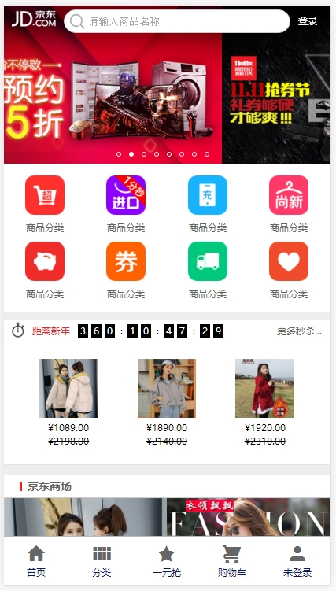
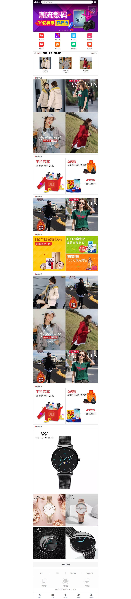

# **JD—phone**
-------  
** 提醒--项目制作由于字体图标-私藏-超级多--导致整体体积大了2M多 **
-------
## 项目介绍 ：
###    京东JD.COM-专业综合网上购物商城，销售超数万品牌、4020万种商品，商品涵盖 家电 、
###    手机 、 电脑 、 图书 、 服装 、母婴、美妆、个护、食品、旅游等13大品类。京东秉承客户为先的 
###    理念，所售商品100％正品行货，全国联保，机打发票，售后保障！提供专业配送，极速送达，为您带
###    来愉悦的购物体验！挑好物，上京东！
------
## 项目职责 ：
###    使用H5C3构建Web App页面，并且使用JS的动态操作和良好的动画很好的加添页面的交
###    互效果--适合不同宽度尺寸的手机页面大部分用到的是百分比的方法搭建和rem作为单位的自动计算缩放
------
## 实现技术 ：HTML/CSS/H5C3/JS
-----
## 项目难点：
###    1、在使用BFC时要明白position的absolute和fixed是会清除浮动同时是不保留位置的，顶部栏
###	      的滚动伴随背景透明的方法
###	   2、轮播图的父盒子最好不要给定固定的总宽度，否则万一后期多加或减少，就维护比较麻烦
###	   3、图片的alt属性最好是加上图片简绍--有效提高收索引擎的效率
###	   4、顶部栏在使用获取scrollTop滚动值的时候，需要注意加上兼容各版本的方法
###    5、在做倒计时的时候费了一点小时间-在计算天-时分秒时必须使用同一个总毫秒，如果使用前一个得
###   		到的时间，它与只有小时和分秒的制作不一样--并且要多考虑其得到的算法中间差，再加一个字符串的
###  	 	转换和截取);
###	   6、也许还有未来道路很多的未知问题-但我热爱这行-所以也喜欢它的规矩了  
###	   7、关于手机的点透 
-----
## 解决方案 ：
###   1、所以在做轮播图时父级高度应该用relative 保留自己的高度-高度由子元素高度撑开，就
###		 不使其宽度为零，找不到轮播图--背景的滚动透明在计算时注意计算顺序和放的前后位置-常会因为位
###		 置错误至计算错误如：4*$(this).height()---其实是$(this).height()*4，
###	  2、最好使用弹性布局+弹性JS方法动态控制 --差点愁死我的轮播图路径/轮播过程中的很多坑，如
###		 停止滚动时，要将过度也停止，或是，循环中不要放函数，导致性能低下，或是开启几个定时器，
###		 按逻辑的需要就停止多少个否则也会导致性能浪费，很多
###	  3、图片的alt属性最好是加上图片简绍--有效提高收索引擎的效率
###	  4、顶部栏的透明滚动浏览器中的兼容查看
###			    `var offsetTop=document.body.scrollTop;`
###       	    `var offsetTop=document.documentElement.scrollTop;`
###      否则很容易出错，页面检测不到
###   5、如果使用前一个得到的时间它与只有小时和分秒的不一样的制作--并且要多考虑其得到的算法中
###       		间差，再加一个字符串的转换和截取); 
###       		`var nowTime = new Date(); `
###            `console.log(nowTime);`
###       		`var nowTimes = nowTime.setDate(nowTime.getDate())/1000;`
### 	  就会得到具体秒数
###       还有想要获取具体的年月日日期，需要加上‘’或是合适的连接符放到 `new Date();`
###   6、所采用了fastclick的方法解决掉--即适用与Web 有适用APP，也要了解Touches/TargetTouches/
###       		`currentTouches--`与`webkitTransitionEnd`的事件过度之后执行
###   7、了解手机点透，touch事件有点透而且只适合移动端，不作用PC端，而click无点透，适合PC和移动
###      但有延时，所以最合适的是fastclick，全部具备
-----
## 项目感受：
###    1、做一个项目难处是要把技术点全部记住，屡清楚做项目的思路。
###	   2、熟悉常用的W3C的规范和标签、样式、让其熟练的在项目中展示，做到孰能生巧，熟悉并优化移
###		 	动端的方案
###	   3、记住JS的常用文档API ，并且要明白DOM、BOM的用处和渲染及一些列的操作，还有一些交互效果，
###		 还有高级的用法，会封装功能组件，模块的调用，也就是面向对象
###	   4、关于JS的一些衍生框架（Vue.JS / React/JS）和组件（Bootstrap.JS / JQuery.JS）,最后还
###		 有Node.JS
###	   5、还有各框架所用的一些组件Element.UI / JQuery.UI / Mint.UI / zepto.js / Amazing.UI ...
###	   6、移动端有响应式开发 或 混合开发 （从平台搭建到最后打包上线应该有熟练的操作认识）
###	   7、关于一些打包工具Webpack / Gulp ，还有一些的项目保存软件Git与GitHub 或是 常用的SVN的 操作
###	   8、对于制图工具Canvas / Echart.js / Three.js 等也要会用
###	   9、对于WeChat也要会做项目熟练其内部API及一些时间等
###	   10、对齐项目工程化也要了解，这样会提高收索引擎的优化（SEO）

------
#####  
#####  
